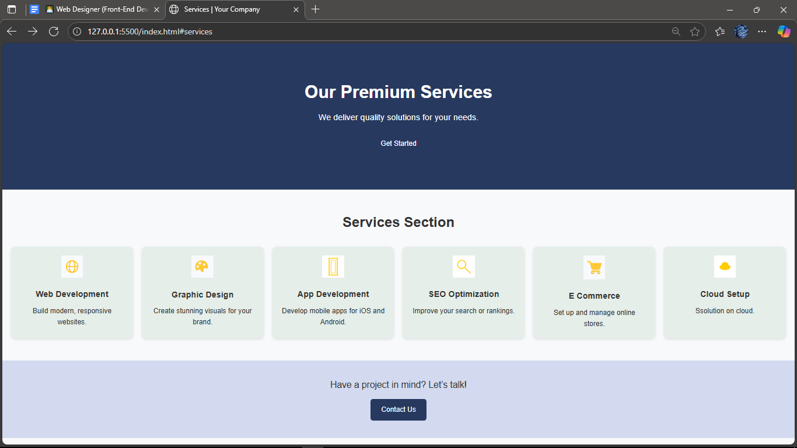

# Responsive-Services-Page
 Visually appealing and responsive "Services" page using HTML and CSS
 # Responsive Services Page

## 📌 Overview
This project is a **responsive and visually appealing services page** built using HTML and CSS.  
It is designed to showcase multiple services in a professional layout with a clean, modern design.  
The page is fully responsive and works seamlessly on **mobile, tablet, and desktop** devices.

## 🎯 Features
- **Hero Section**
  - Full-width banner with heading, subheading, and call-to-action button.
- **Services Section**
  - 6 service cards with icons, titles, and short descriptions.
  - Responsive grid layout using Flexbox.
- **Contact CTA**
  - Call-to-action section encouraging visitors to get in touch.
- **Responsive Design**
  - Optimized for all screen sizes using CSS media queries.
- **Hover Effects**
  - Smooth hover animations for service cards.

## 🛠 Technologies Used
- **HTML5**
- **CSS3** (Flexbox, Media Queries)
- **Icons** (Custom PNG images)
- **Optional**: Can be easily extended with Bootstrap or Tailwind CSS.

## 📂 Project Structure
project/
│── icons/ # Service icons
│── index.html # Main HTML file
│── style.css # Stylesheet

## 📱 Responsiveness
The layout adapts to:
- **Mobile devices** (single-column layout)
- **Tablets** (two-column layout)
- **Desktops** (multi-column layout)

## 🚀 How to Run
1. Download or clone this repository.
     
3. Open the `index.html` file in your browser.

## 📸 Screenshot
📸 Screenshot

## 📜 License
This project is open-source and free to use.
